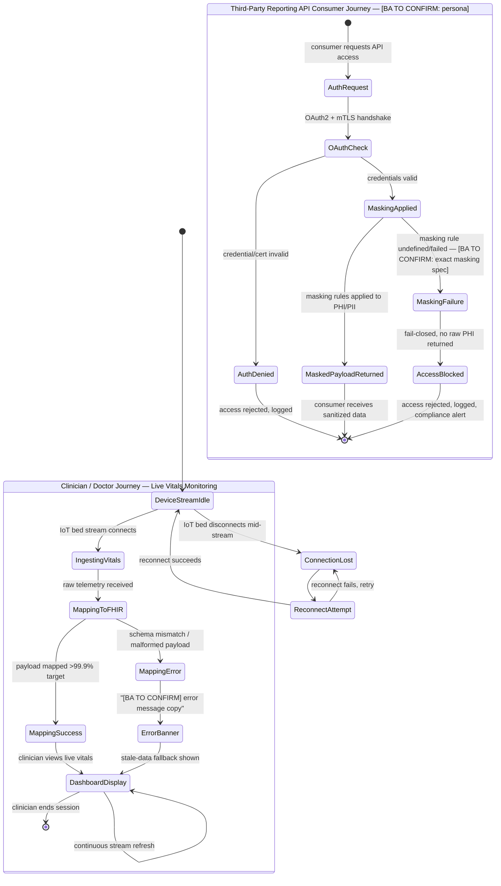

1. MERMAID.JS BEHAVIORAL FLOWS



2.

```yaml
node_2_status: "CLEAR"

wireframes:
  - screen: "Live Vitals Dashboard"
    header: "Clinician / Doctor"
    cta: ["Acknowledge Alert", "View Patient History (if in scope — not confirmed, excluded from MVP wireframe)"]
    data: ["Real-time vitals stream (IoT bed source)", "FHIR R4-mapped patient telemetry", "Last-sync timestamp"]
    error: ["Stale-data fallback banner on mapping error", "[BA TO CONFIRM] exact error message copy — not specified in intake"]

  - screen: "Vitals Stream Connection Status"
    header: "Clinician / Doctor"
    cta: ["Retry Connection"]
    data: ["IoT bed device ID", "Connection state (live / reconnecting / lost)"]
    error: ["Connection lost banner", "Reconnect-in-progress indicator"]

  - screen: "Third-Party Reporting API Access Gate"
    header: "[BA TO CONFIRM] — no named end-user persona for this consumer in Node 1"
    cta: ["Submit OAuth2 Credentials", "Present mTLS Certificate"]
    data: ["Auth status", "Masked payload response (on success)"]
    error: ["Access Denied — invalid credentials", "Access Blocked — masking rule not applied (fail-closed), compliance alert logged"]

ux_edge_cases:
  - type: "GAP"
    description: "Exact data masking rule set for reporting API is undefined per Node 1's Boundary Assumptions Registry — wireframe shows fail-closed behavior only, not the masking logic itself."
  - type: "BA_TO_CONFIRM"
    description: "No named persona exists for the third-party reporting API consumer; screen header left unassigned rather than reusing 'Clinician / Doctor'."
  - type: "RACE"
    description: "IoT bed stream reconnect vs. live dashboard refresh — no stated behavior for what the clinician sees during the reconnect window (stale data vs. blank state)."
  - type: "BA_TO_CONFIRM"
    description: "No error message copy defined anywhere in the intake for the FHIR mapping failure state shown in the Mermaid flow."
```

3.

```yaml
---
Digest: Node 2 UI Architecture
Timestamp: 2026-08-14 05:20:50Z
DSM_Tier: Medium
Upstream_Dependency: Node 1 Scope Digest
---
```

==================================================
PIPELINE HANDOFF DIGEST
==================================================

```yaml
mapped_flows: 2
wireframes_generated: 3
primary_personas_referenced: ["Clinician / Doctor"]
ux_ambiguities: 4
```

==================================================
HANDOFF
==================================================
node_2_status: CLEAR. Copy this ENTIRE response (the data payload + this digest) and paste it into Node 3.
